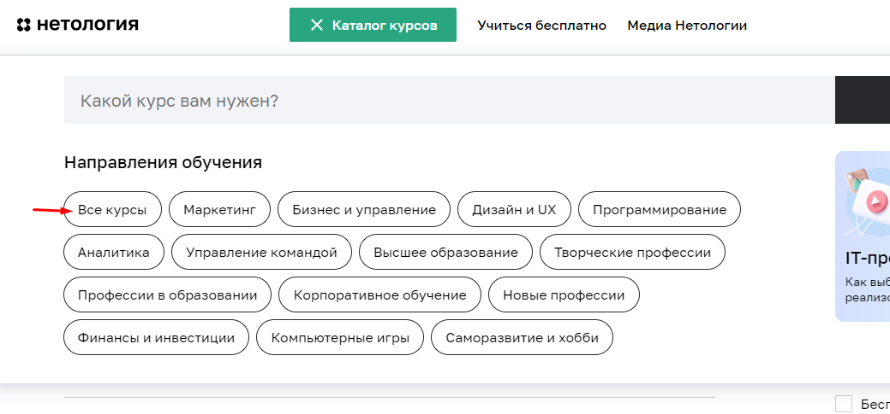

# План внедрения автоматизации
## 1. Перечень автоматизируемых сценариев.
## **1.1 Автоматизация переходов с главной страницы до анкеты записи на странице**
*Предусловия:*  Открыта главная страница сайта Нетология www.netology.ru
*Ожидаемых результат:* Переход на страницы профессии “Тестировщик ПО”

* ### **Переход через Каталог курсов-Программирование - Раздел профессии курса**
#### Шаги
1. Нажать на кнопку “Каталог курсов” на главной странице сайта

2. Нажать на кнопку “Программирование” из выпавшего списка

3. Проскроллить/пролистать до раздела “Тестировщик ПО” 
4. Нажать на раздел с профессией

* ### **Переход через Каталог курсов поисковую строку**
#### Шаги
1. Нажать на кнопку “Каталог курсов” на главной странице сайта
2. Нажать на поле ввода для поиска
3. Набрать первые несколько букв профессии (Тест)

4. Нажать на иконку профессии из предлагаемого списка

* ### **Переход через Каталог курсов-все курсы и раздел профессии**
#### Шаги
1. Нажать на кнопку “Каталог курсов” на главной странице сайта
2. Нажать кнопку “Все курсы” из выпадающего списка

3. Проскроллить/пролистать до раздела “Тестировщик ПО” 
4. Нажать на раздел с профессией

* ### **Переход через каталог курсов - все курсы и поисковую строку**
#### Шаги
1. Нажать на кнопку “Каталог курсов” на главной странице сайта
2. Нажать кнопку “Все курсы” из выпадающего списка
3. Нажать на поле ввода для поиска
4. Набрать первые несколько букв профессии (Тест)
5. Нажать на иконку профессии из предлагаемого списка

* ### **Переход через раздел Направления обучения- программирование и раздел профессии**
#### Шаги
1. Пролистать страницу до раздела Направления обучения

2. Нажать на раздел программирование
3. Проскроллить/пролистать до раздела “Тестировщик ПО” 
4. Нажать на раздел с профессией

* ### **Переход через раздел Направления обучения программирование и поисковую строку**
#### Шаги
1. Пролистать страницу до раздела Направления обучения
2. Нажать на раздел программирование
3. Нажать на поле ввода для поиска
4. Набрать первые несколько букв профессии (Тест)

5. Нажать на иконку профессии из предлагаемого списка

* ### **Переход  через раздел Направления обучения, полный каталог и раздел професси**
#### Шаги
1. Пролистать страницу до раздела Направления обучения
2. Нажать на кнопку “Полный каталог”

3. Проскроллить/пролистать до раздела “Тестировщик ПО” 
4. Нажать на раздел с профессией

* ### **Переход  через раздел Направления обучения, полный каталог и поисковую строку**
#### Шаги
1. Пролистать страницу до раздела Направления обучения
2. Нажать на кнопку “Полный каталог”
3. Нажать на поле ввода для поиска
4. Набрать первые несколько букв профессии (Тест)
5. Нажать на иконку профессии из предлагаемого списка

* ### **Переход  через раздел Направления обучения, полный каталог, программирование и раздел профессии**
#### Шаги
1. Пролистать страницу до раздела Направления обучения
2. Нажать на кнопку “Полный каталог”
3. Нажать на кнопку “Программирование” из выпадающего списка

4. Проскроллить/пролистать до раздела “Тестировщик ПО” 
Нажать на раздел с профессией

* ### **Переход  через раздел Направления обучения, полный каталог, программирование и поисковую строку**
#### Шаги
1. Пролистать страницу до раздела Направления обучения
2. Нажать на кнопку “Полный каталог”
3. Нажать на кнопку “Программирование” из выпадающего списка 
4. Нажать на поле ввода для поиска
5. Набрать первые несколько букв профессии (Тест)
6. Нажать на иконку профессии из предлагаемого списка

## **1.2 Автоматизация перехода на анкету для записи со страницы профессии**

*Предусловия:* Открыта страница профессии “Тестировщик ПО” на сайте Нетологии https://netology.ru/programs/qa

*Ожидаемый результат:* Переход на анкету записи на обучения

 * ### **Переход через кнопку “Записаться” под кратким описанием курса**
Пролистать страницу по кнопки “Записаться”

* ### **Переход через кнопку “Записаться” на верху страницы**
Пролистать страницу до появления кнопки “Записаться” на верху страницы

* ### **Пролистав страницу до конца, дойти до анкеты**
Пролистать страницу до конца описания курса 

## **1.3 Автоматизация тестирования отправки формы для записи на обучения**
*Предусловие:* Открыта форма для записи на курс “Тестировщик ПО” на сайте Нетологии https://netology.ru/programs/qa#/order

**Заполнение анкеты валидными данными (happy path)**
* Поле "Имя"
Валидные данные: кириллица, латиница, пробел, дефис(паример: Сергей, Sergey, Петр-Сергей, Петр Сергей)
* Поле "Номер телефона"
Валидные данные: символ + в начале, 11 арабских цифр, пробел, тире( пример:+7(954) 65-47-752)
* Поле "Электронная почта"
Валидные данные:латиница верхнего и нижнего регистра, цифры, точка, дефис и underlined в имени аккаунта, символ @, доменная часть, точка, имя домена (например S.sergey45.57@gmail.com)

* ## **Отправка формы заполненной валидными данными**
  1.  Заполнить все поля валидными данными
  2. Нажать кнопку “Записаться”

*Ожидаемый результат:* Отправка формы с надписью “Ваша анкета отправлена”

* ## **Отправка формы с  невалидными данными**

**Отправка формы с пустыми полями**
1. Оставить все поля незаполненными
2. Нажать на кнопку “Записаться”

*Ожидаемый результат:* Сообщение об ошибке под всеми полями “Обязательное поле”

* ## **Отправка формы с невалидными данными в поле “Имя"**
1. Ввести в поле “Имя” не валидные значения (например: Сергей42, Сергей%,Сергей ♣)
2. Остальные поля заполнить валидными данными
3. Нажать кнопку “Записаться”

*Ожидаемый результат:* Сообщение об ошибке под полем “Имя” “"Должно состоять из букв”

* ## **Отправка формы с невалидными данными в поле “Номер телефона”**
1. Ввести в  поле “Номер телефона” невалидные данные с буквами(например:+7(999) 99-999-99АЛ)
2. Остальные поля заполнить валидными данными
3. Нажать на кнопку “Записаться”

*Ожидаемый результат:* Ошибка под полем “Номер телефона” “Номер в формате +9 (999) 999-99-99”

* ## **Отправка формы с невалидными данными в поле “Номер телефона”** ( 9 цифр)
1. Ввести в  поле “Номер телефона”  данные из 9 цифр (например:+7(999) 99-999)
2. Остальные поля заполнить валидными данными
3. Нажать на кнопку “Записаться”

*Ожидаемый результат:* Ошибка под полем “Номер телефона” “Номер в формате +9 (999) 999-99-99”

* ## **Отправка формы с невалидными данными в поле “Номер телефона”** (12 цифр)
1. Ввести в  поле “Номер телефона”  данные из 12 цифр (например:+7(999) 99-999-9999)
2. Остальные поля заполнить валидными данными
3. Нажать на кнопку “Записаться”

*Ожидаемый результат:* Ошибка под полем “Номер телефона” “Номер в формате +9 (999) 999-99-99”

* ## **Отправка формы с невалидными данными в поле “Номер телефона”** (11 нулей)
1. Ввести в  поле “Номер телефона”  данные с 11 нулями(например:+0(000)000-00-00)
2. Остальные поля заполнить валидными данными
3. Нажать на кнопку “Записаться”

*Ожидаемый результат:* Ошибка под полем “Номер телефона” “Номер в формате +9 (999) 999-99-99”

* ## **Отправка формы с невалидными данными в поле “Электронная почта”** (Без @ в доменной части)
1. Ввести в поле “Электронная почта” невалидные данные без символа @ в доменной части( например:sergey47gmail.com)
2. Остальные поля заполнить валидными данными
3. Нажать на кнопку “Записаться”

*Ожидаемый результат:* Ошибка под полем “Электронная почта” “Неверный email”

* ## **Отправка формы с невалидными данными в поле “Электронная почта”** (кириллица в аккаунтой части)
1. Ввести в поле “Электронная почта” невалидные данные кириллица в аккаунтой части( например:сергей47gmail.com)
2. Остальные поля заполнить валидными данными
3. Нажать на кнопку “Записаться”

*Ожидаемый результат:* Ошибка под полем “Электронная почта” “Неверный email”

* ## **Отправка формы с невалидными данными в поле “Электронная почта”** (@ в начале)
1. Ввести в поле “Электронная почта” невалидные данные кириллица в аккаунт ой части( например:@Sergey47gmail.com)
2. Остальные поля заполнить валидными данными
3. Нажать на кнопку “Записаться”

*Ожидаемый результат:* Ошибка под полем “Электронная почта” “Неверный email”

* ## **Отправка формы с невалидными данными в поле “Электронная почта”** (без точки в доменной части)
1. Ввести в поле “Электронная почта” невалидные данные без точки в доменной части( например:@Sergey47gmailcom)
2. Остальные поля заполнить валидными данными
3. Нажать на кнопку “Записаться”

*Ожидаемый результат:* Ошибка под полем “Электронная почта” “Неверный email”

* ## **Отправка формы с невалидными данными в поле “Электронная почта”** (пробел в имени аккаунта)
1. Ввести в поле “Электронная почта” невалидные данные пробел в имени аккаунта( например:@Sergey 47gmailcom)
2. Остальные поля заполнить валидными данными
3. Нажать на кнопку “Записаться”

*Ожидаемый результат:* Ошибка под полем “Электронная почта” “Неверный email”

* ## **Отправка формы с невалидными данными в поле “Электронная почта”** (без доменной части)
1. Ввести в поле “Электронная почта” невалидные данные без доменной части( например:@Sergey47@.com)
2. Остальные поля заполнить валидными данными
3. Нажать на кнопку “Записаться”

*Ожидаемый результат:* Ошибка под полем “Электронная почта” “Неверный email”

* ## **Отправка формы с невалидными данными в поле “Электронная почта”** (точка в конце)
1. Ввести в поле “Электронная почта” невалидные данные точка последний символ( например:@Sergey47@gmail.com.)
2. Остальные поля заполнить валидными данными
3. Нажать на кнопку “Записаться”

*Ожидаемый результат:* Ошибка под полем “Электронная почта” “Неверный email”

* ## **Отправка формы с невалидными данными в поле “Электронная почта”** (точка в начале имени аккаунта)
1. Ввести в поле “Электронная почта” невалидные данные точка в начале имени аккаунта( например: .Sergey47@gmail.com)
2. Остальные поля заполнить валидными данными
3. Нажать на кнопку “Записаться”

*Ожидаемый результат:* Ошибка под полем “Электронная почта” “Неверный email”

## 2. Перечень используемых инструментов с обоснованием выбора.

 * JDK (Java Development Kit ) комплект разработчика приложений на языке Java, включающий в себя компилятор Java (javac), стандартные библиотеки классов Java, примеры, документацию, различные утилиты и исполнительную систему Java (JRE), загрузчик кода java, компилятор javac, архиватор jar, генератор документации javadoc и другие утилиты, нужные во время разработки.

 * JUnit5 фреймворк для автоматического юнит-тестирования приложений. Он содержит специальные функции и правила, которые позволяют легко писать и запускать тесты, то есть проверять, что каждый блок кода, или модуль, ответственный за определенную функцию программы, работает как надо

 * Selenide это обёртка вокруг Selenium WebDriver, позволяющая быстро и просто его использовать при написании тестов, сосредоточившись на логике, а не суете с браузером.При вызове метода open Selenide сам запускает браузер и открывает страницу, а также заботится о том, чтобы в конце браузер закрылся.Одной из главных проблем при тестировании веб-приложений является ожидание изменений в DOM-структуре и загрузки AJAX-контента. Selenide решает эту проблему путем автоматического ожидания элементов и проверки их состояния. Это упрощает написание тестов и делает их более стабильными.

* Faker  это библиотека, которая позволяет генерировать случайные данные. С ее помощью можно заполнить таблицы в базе данных, построить корректные XML-документы, сформировать JSON-ответы для REST.

* DevTools-это набор инструментов, встроенных в браузер, для создания и отладки сайтов. С их помощью можно просматривать исходный код сайта, отлаживать работу frontend: HTML, CSS и JavaScript.

## 3. Перечень необходимых разрешений, данных и доступов.

* Обязательно: Получить разрешение от владельца сайта на тестирование и автоматизацию тестирования.

* Опционально: Получить ТЗ, данные для заполнения тестируемой формы, доступ к Базе Данных и API.

## 4. Перечень и описание возможных рисков при автоматизации.
* Увеличение стоимости тестирования (аренда техники, заработная плата и т.д.)
* Увеличение времени тестирования( отсутствие тестовых меток, поменялась структура HTML/CSS, болезнь, неверно подобранные инструменты)

 
## 5. Перечень необходимых специалистов для автоматизации.
* Один тестировщик-автоматизатор

## 6. Интервальная оценка с учетом рисков в часах

* 25-27 часов с учетом рисков.

